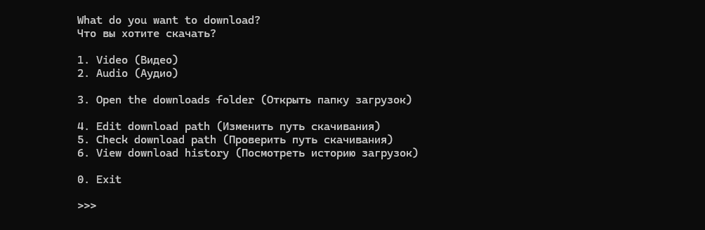

# Video & Audio Downloader (ytdlp-cli)



Простая консольная программа на Python для скачивания видео и аудио из интернета (включая Youtube) с помощью библиотеки 'yt-dlp'

# Основные возможности:
1. Скачивание видео в хорошем качестве (по умолчанию <=1080p в формате webm)
2. Конвертация в аудио (извлечение звуковой дорожки в формате webm)
3. Умный поиск: можно вставлять как URL ссылку напрямую, так и указывать название вручную
4. Сохранение: пути для видео и аудио настраиваются через CLI и графическое окно, не нужно лезть в код
5. Быстрый доступ к файлам: папку с загрузками можно открыть прямо из меню программы
6. Просмотр истории скачиваний через CLI
7. Функция *multiple download*, позволяет скачать список аудио с помощью текстового документа
8. Настройка собственного прокси


# Клонировать репозиторий:
```bash
   git clone --depth 1 https://github.com/quasarusx/ytdlp-cli.git
   cd ytdlp-cli
```

# Рекомендации

**Для корректной работы программы необходим Python 3.7 и утилита **FFMPEG** (обязательна для работы yt-dlp)**

Создайте виртуальное окружение (рекомендуется):
python -m venv .venv

 Для Windows 
.venv\Scripts\activate

 Для Mac / Linux
source venv/bin/activate

Установите необходимые зависимости:
pip install -r requirements.txt

Запустить программу через консоль:
python main.py


# Cборка в автономный .exe файл

Внутри виртуального окружения установите pyinstaller:

pip install pyinstaller

Запустите сборку:

pyinstaller --onefile main.py

Готовый файл появится в папке dist/


```text
//      //  ///////      //////    //          ///////   
 //    //     //         //    //  //          //    //  
  //  //      //         //    //  //          ///////   
   ////       //         //    //  //          //        
    //        //         //    //  //          //        
    //        //         //////    //////      //       

  ///////  //          //  
 //        //          //  
//         //          //  
//         //          //  
 //        //          //  
  ///////  //////      //
